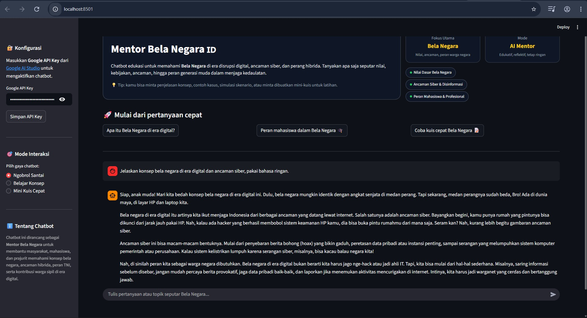

# 🇮🇩 Mentor Bela Negara ID

> **AI Chatbot edukasi Bela Negara** di era disrupsi digital, ancaman siber, dan perang hibrida.  
> Dibangun dengan **Python + Streamlit + Gemini (Google AI)**.

---

<p align="center">
  
</p>

---

## ✨ Fitur Utama

- 💬 **Ngobrol Santai** – Jelaskan konsep Bela Negara dengan bahasa ringan dan dekat dengan dunia generasi muda.
- 📚 **Belajar Konsep** – Mode lebih terstruktur untuk memahami nilai, ancaman, dan kebijakan Bela Negara.
- 🧠 **Mini Kuis Cepat** – Latihan singkat untuk menguji pemahaman pengguna.
- 🛡️ **Fokus Topik**:
  - Nilai Dasar Bela Negara  
  - Ancaman Siber & Disinformasi  
  - Peran Mahasiswa & Profesional di era digital  
- 🎨 **UI gelap yang modern** berbasis Streamlit dengan layout yang simpel dan responsif.

---

## 🧱 Teknologi yang Digunakan

- [Python](https://www.python.org/)
- [Streamlit](https://streamlit.io/) – untuk antarmuka web interaktif
- [LangChain](https://python.langchain.com/) – manajemen percakapan & prompt
- [Google Gemini API](https://ai.google.dev/) – Large Language Model
  
---

## 🚀 Cara Menjalankan Secara Lokal

### 1. Clone repository

```bash
git clone https://github.com/USERNAME/mentor-bela-negara-id.git
cd mentor-bela-negara-id

